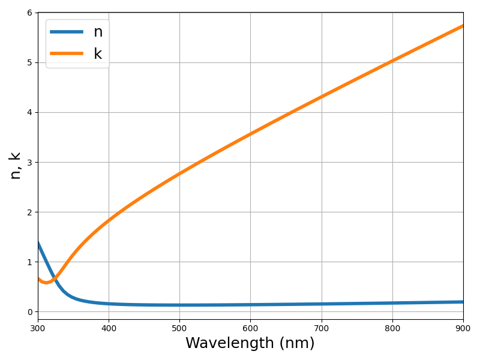
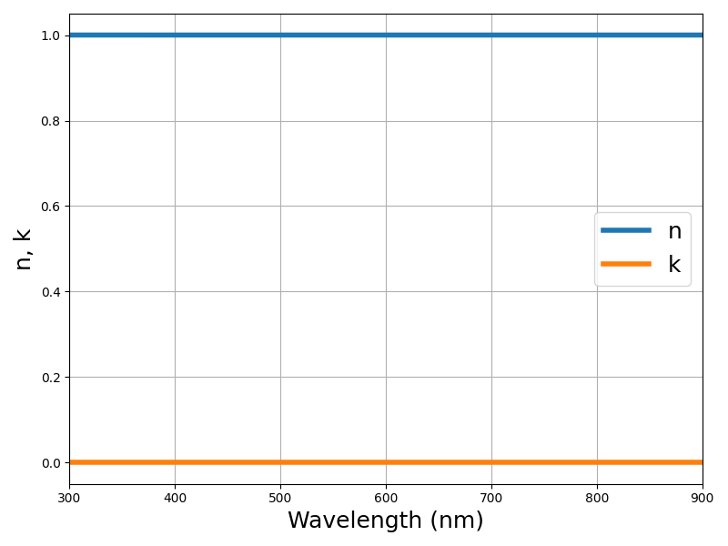
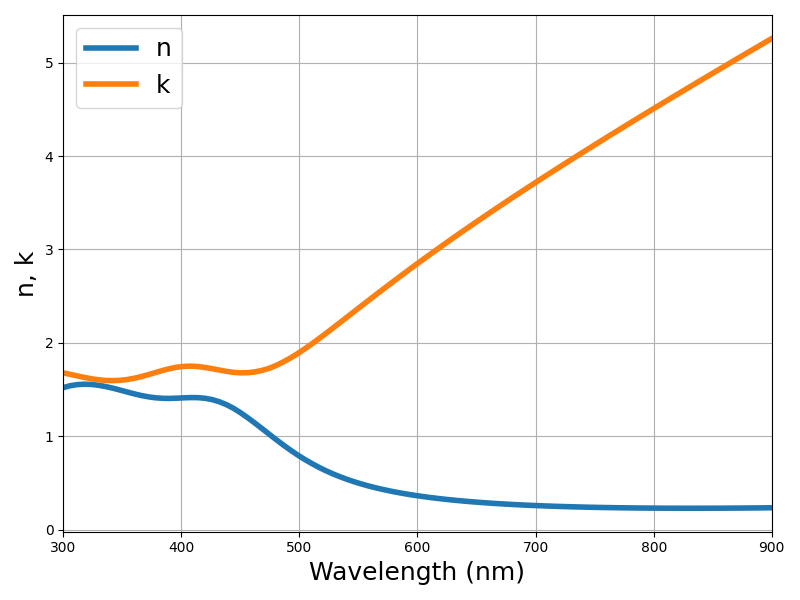
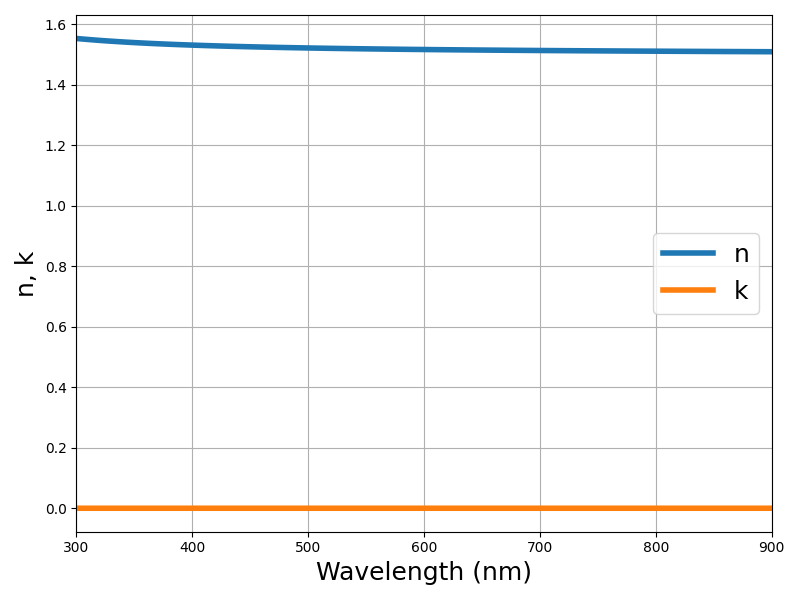
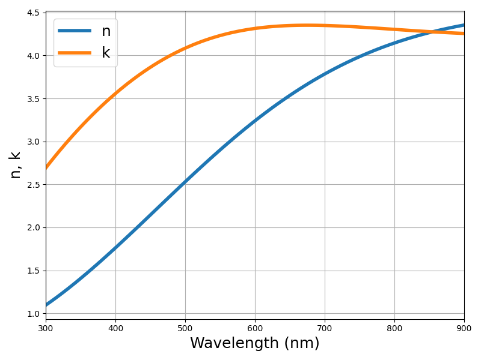
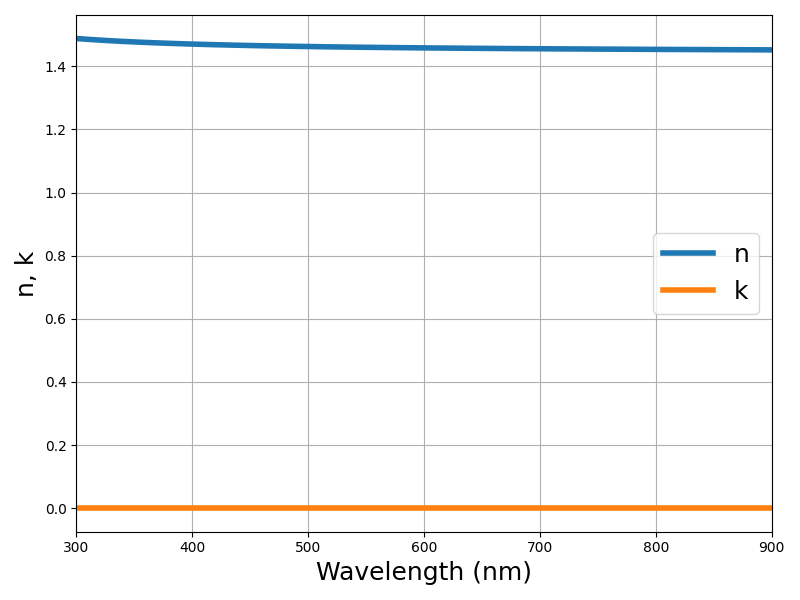
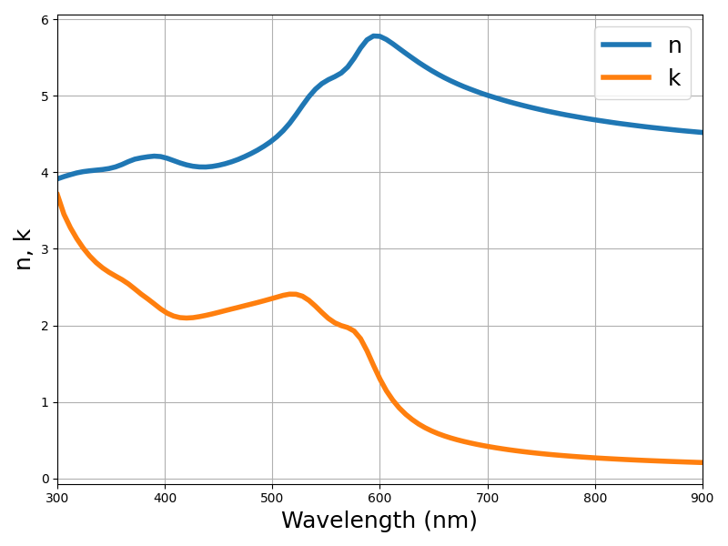
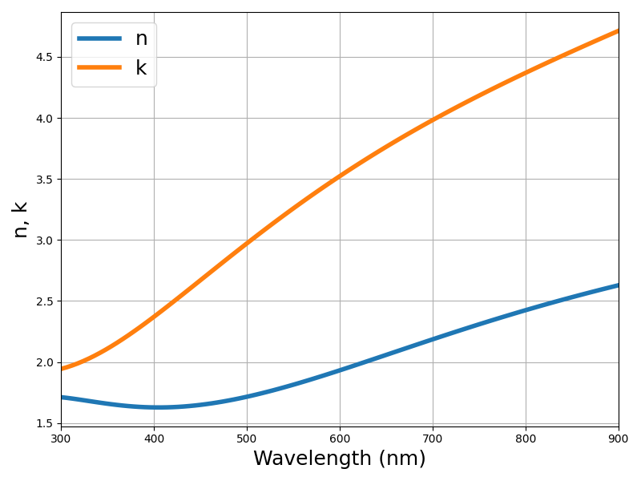
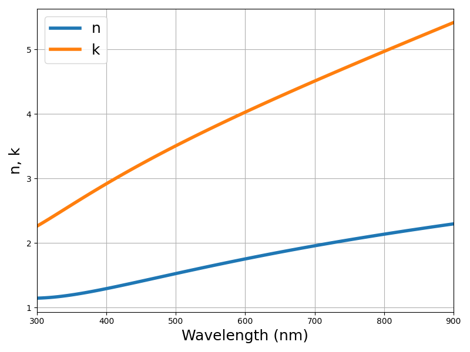
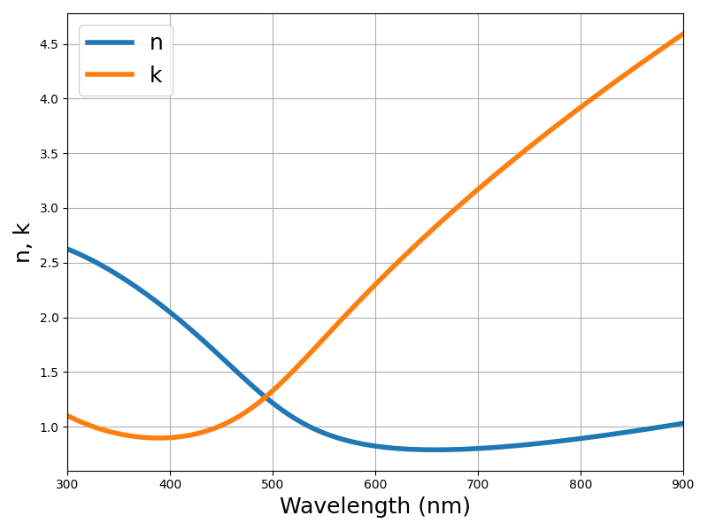

# Supported Materials

Ag, Air, Al2O3, Al, Au, BK7, Cr, Cu, FusedSilica, GaAs, Ge, Mn, Ni, Pd, Pt, Si3N4, SiO2, TiN, TiO2, Ti, W

- Ag

- Air

- Al2O3

- Al

- Au

- BK7

- Cr

- Cu

- FusedSilica

- GaAs

- Ge

- Mn

- Ni

- Pd

- Pt

- Si3N4

- SiO2

- TiN

- TiO2

- Ti

- W

