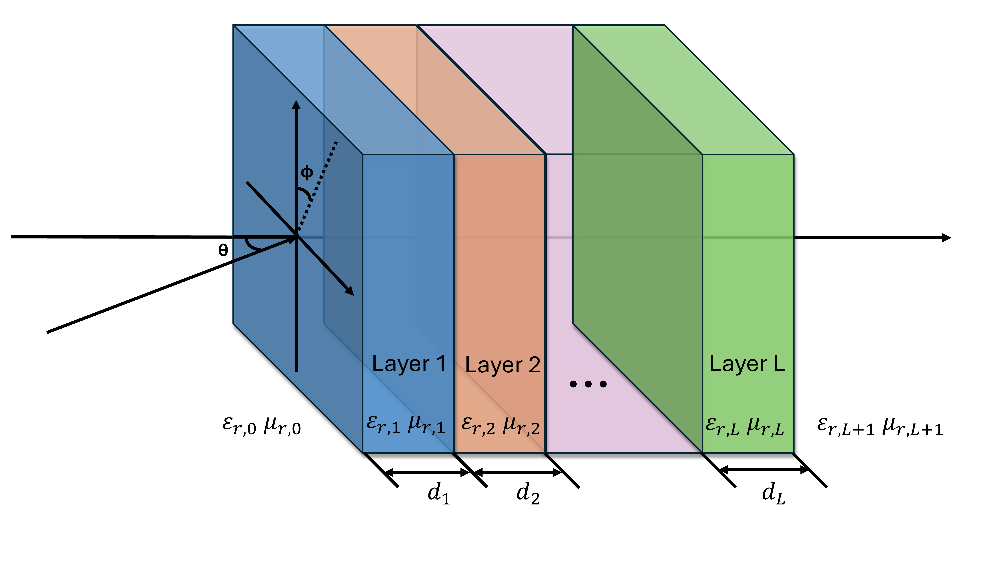

JaxLayerLumos: A JAX-based Differentiable Optical and Radio Frequency Simulator for Multilayer Structures
=========================================================================================================

.. image:: _static/img/jaxlayerlumos.jpg
    :width: 400
    :align: center
    :alt: jaxlayerlumos

JaxLayerLumos is open-source transfer-matrix method (TMM) software designed for scientists, engineers, and researchers in optics and photonics. It provides a powerful yet intuitive interface for calculating the reflection and transmission (RT) of light through multi-layer optical structures. By inputting the refractive index, thickness of each layer, and the frequency vector, users can analyze how light interacts with layered materials, including the option to adjust for incidence angles.

Our mission is to offer a lightweight, flexible, and fast alternative to commercial software, enabling users to perform complex optical simulations with ease. JaxLayerLumos is built with performance and usability in mind, facilitating the exploration of optical phenomena in research and development settings.

Features
--------

- Gradient Calculation: Calculates the gradients over any variables involved in RT, powered by JAX.
- Flexibility: Accommodates a wide range of materials and structures by allowing users to specify complex refractive indices, layer thicknesses, and frequency vectors.
- Angle of Incidence Support: Expands simulation capabilities to include angled light incidence, providing more detailed analysis for advanced optical designs.
- Open Source and Community-Driven: Encourages contributions and feedback from the community, ensuring continuous improvement and innovation.
- Comprehensive Material Database: Includes a growing database of materials with their optical properties, streamlining the simulation setup process.

.. toctree::
    :maxdepth: 1
    :caption: About JaxLayerLumos:

    about/installation
    about/examples
    about/software_testing
    about/supported_materials
    about/contributing_guidelines
    about/license
    about/acknowledgments
    about/citation

.. toctree::
    :maxdepth: 2
    :caption: Python API:

    python_api/jaxlayerlumos
