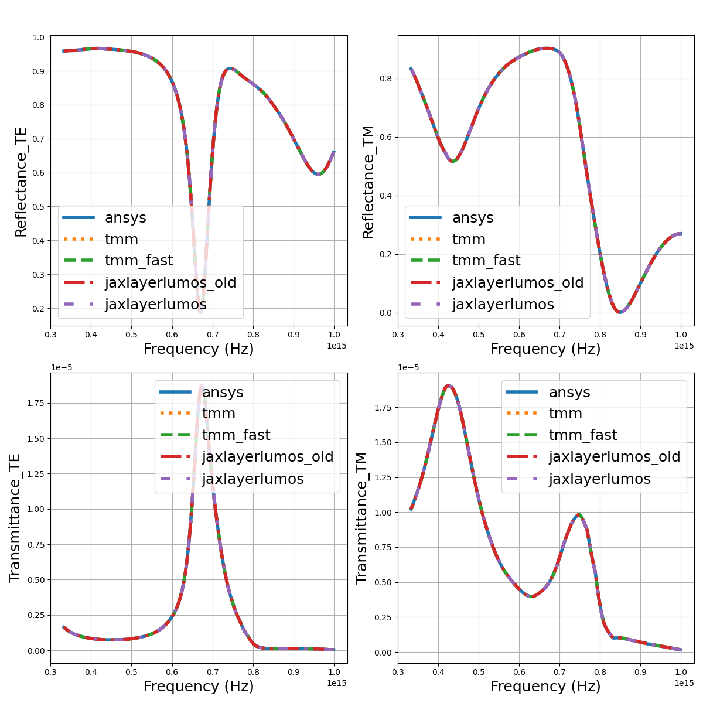
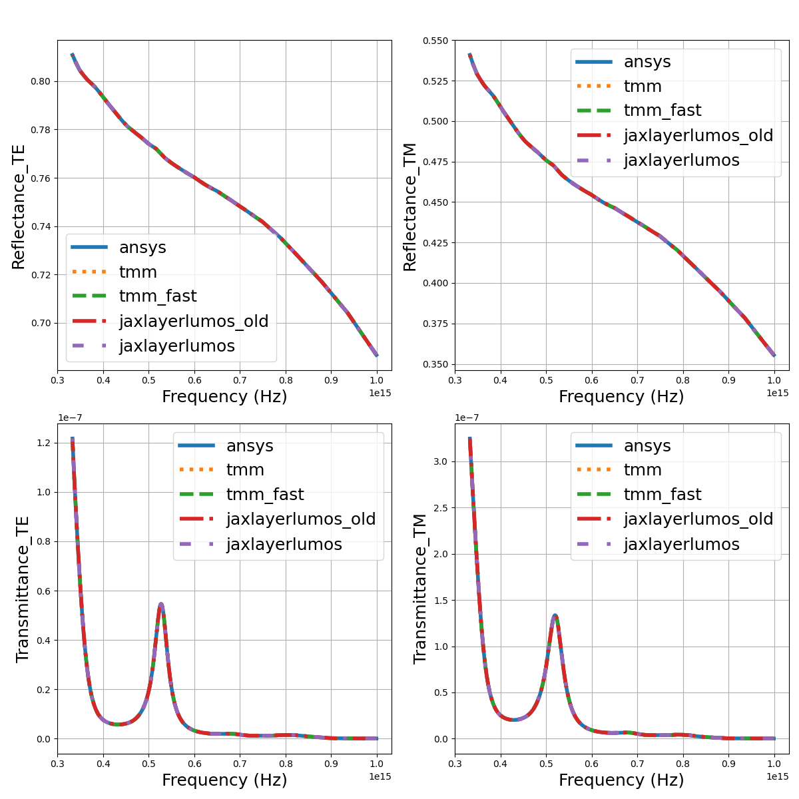
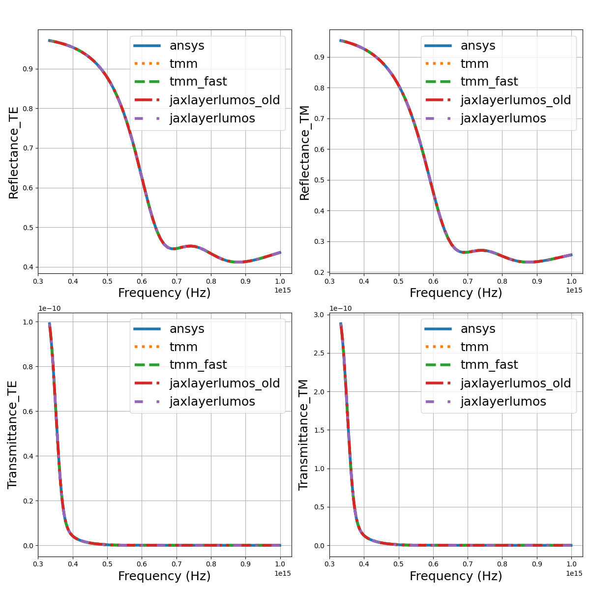
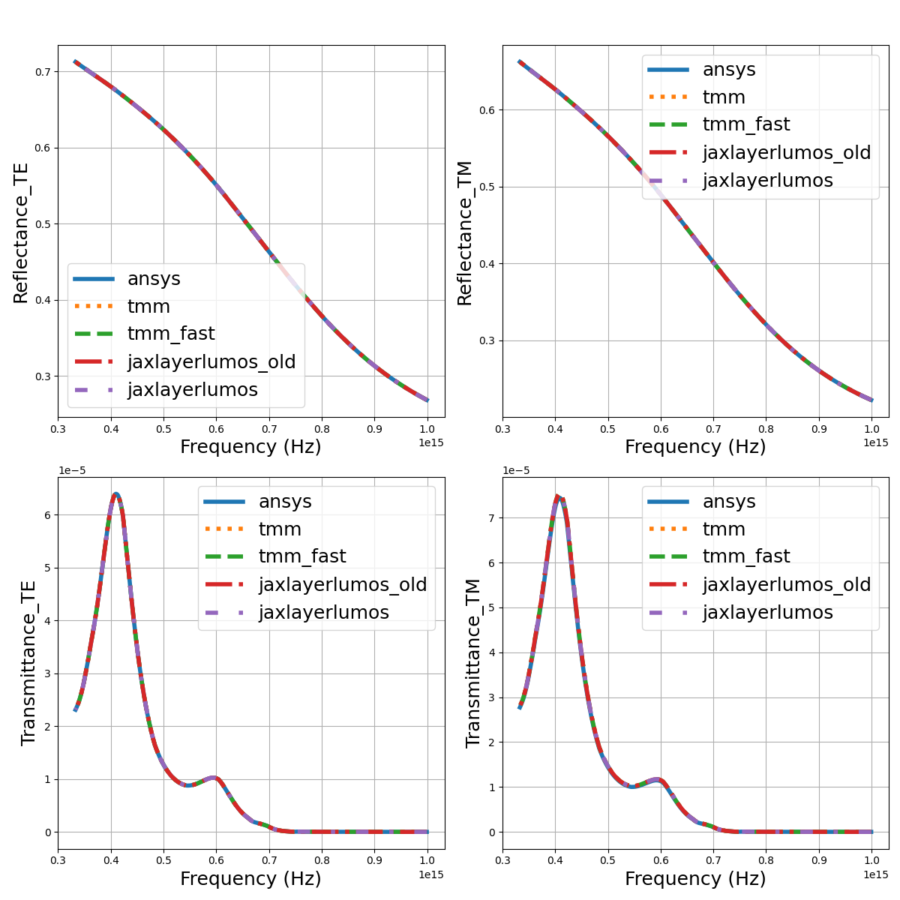
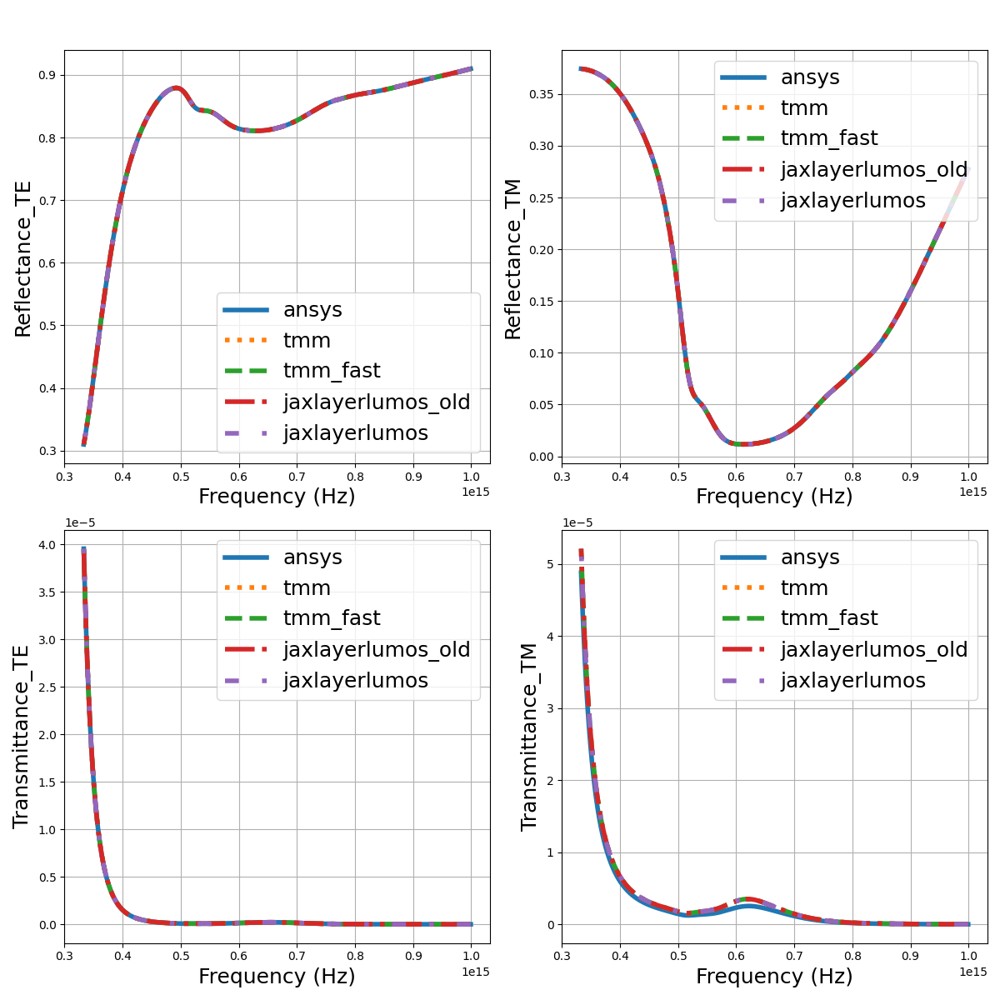
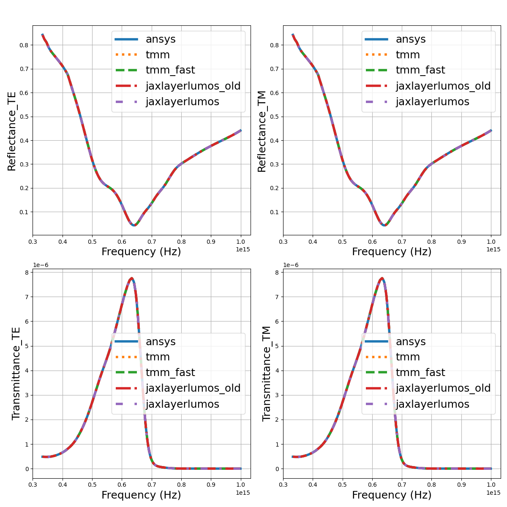
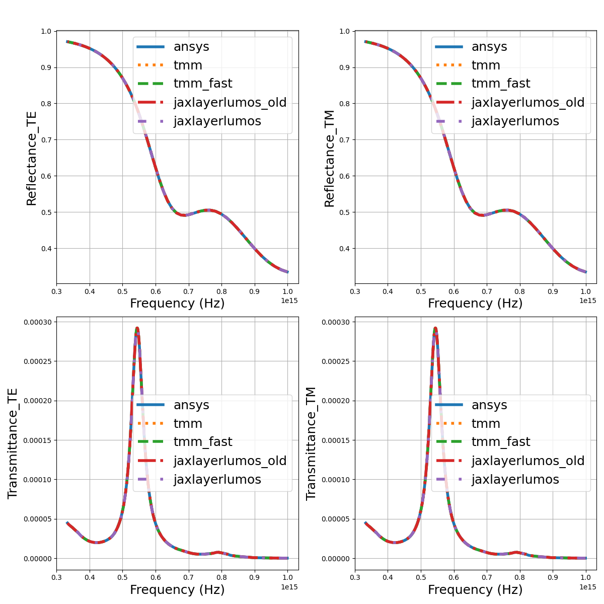
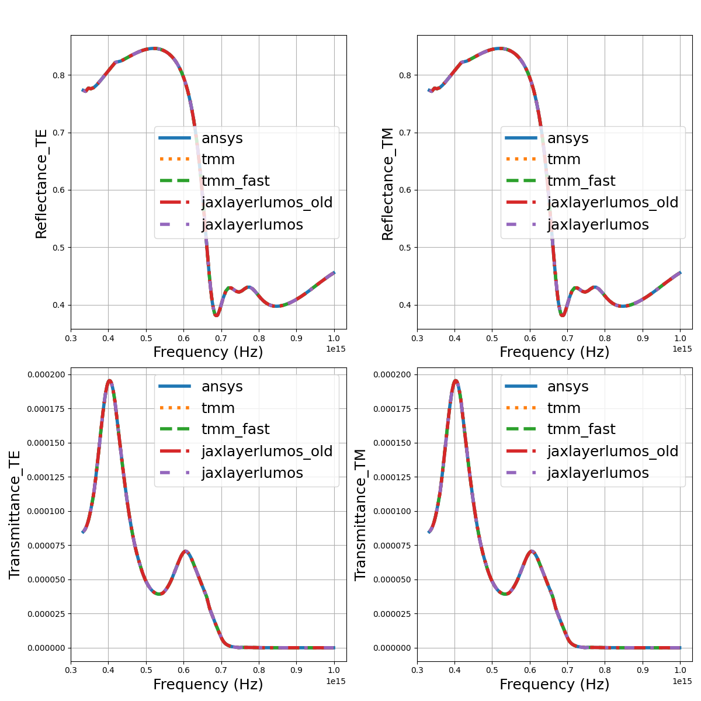
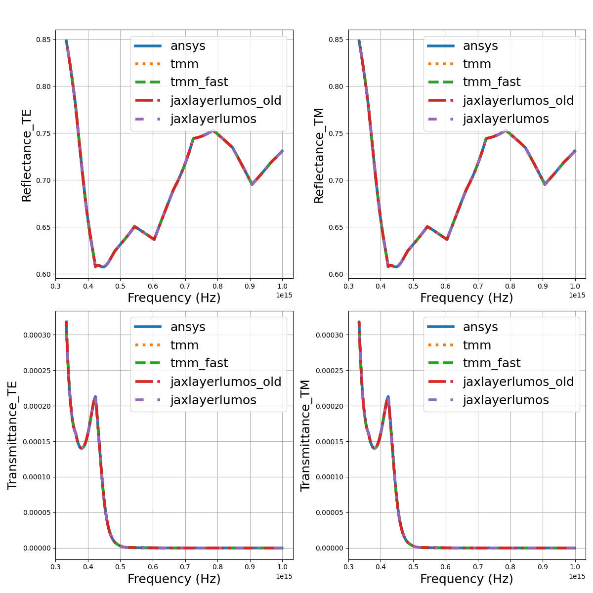

# Benchmarking

You should install the packages required for benchmarking our software against existing methods.
Before installing the packages, you should install PyTorch first.
In particular, you can install it using the following command.

```bash
pip install torch --index-url https://download.pytorch.org/whl/cpu
```

For details, you can refer to [the official instruction of PyTorch](https://pytorch.org).
Then, the required packages can be installed by the following command.

```bash
pip install .[benchmarking]
```

## Comparisons to Ansys Optics

[Ansys Optics](https://www.ansys.com/products/optics), [TMM-Fast](https://github.com/MLResearchAtOSRAM/tmm_fast), and [tmm](https://github.com/sbyrnes321/tmm) are compared to our software.

<p align="center">

</p>

<p align="center">

</p>

<p align="center">

</p>

<p align="center">

</p>

<p align="center">

</p>

<p align="center">

</p>

<p align="center">

</p>

<p align="center">

</p>

<p align="center">

</p>

<p align="center">

</p>
