# Supported Materials

39 materials: Ag, Air, Al2O3, Al, aSi, aSi-Zarei, Au, AZO-Zarei, BK7, Cr, cSi, Cu, Fe, FusedSilica, GaAs, GaInP, GaP, Ge, InP, ITO, ITO-Zarei, Mg, Mn, Ni, Pb, Pd, Pt, Sapphire, Si3N4, Si3N4-Zarei, SiO2, SiO2-Zarei, TiN, TiO2, TiO2-Zarei, Ti, W, ZnO, Zn

- Ag

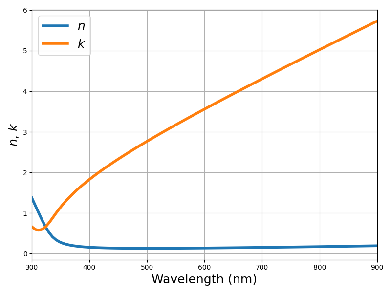

- Air

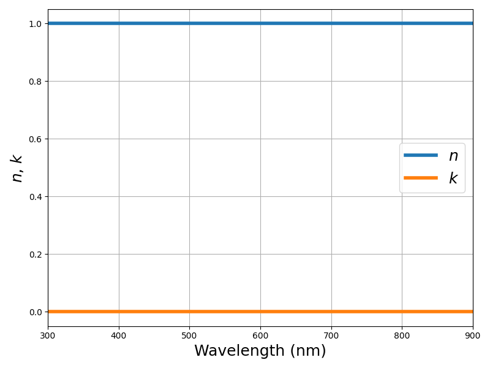

- Al2O3

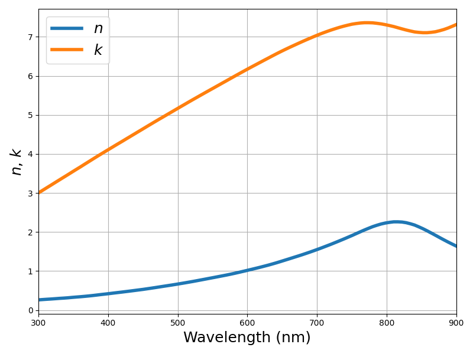

- Al

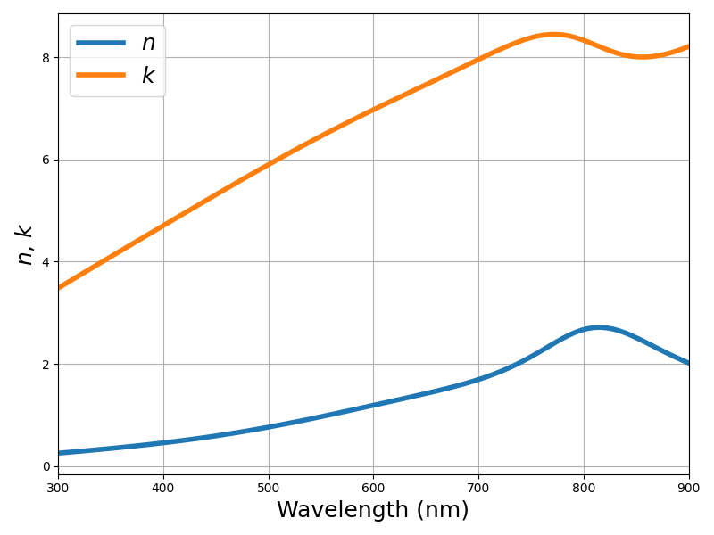

- aSi

- aSi-Zarei

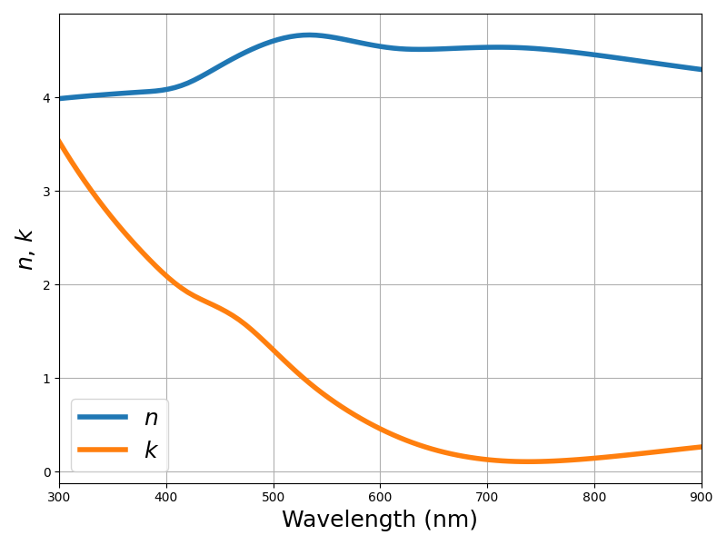

- Au

- AZO-Zarei

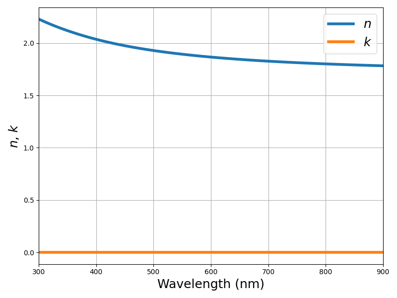

- BK7

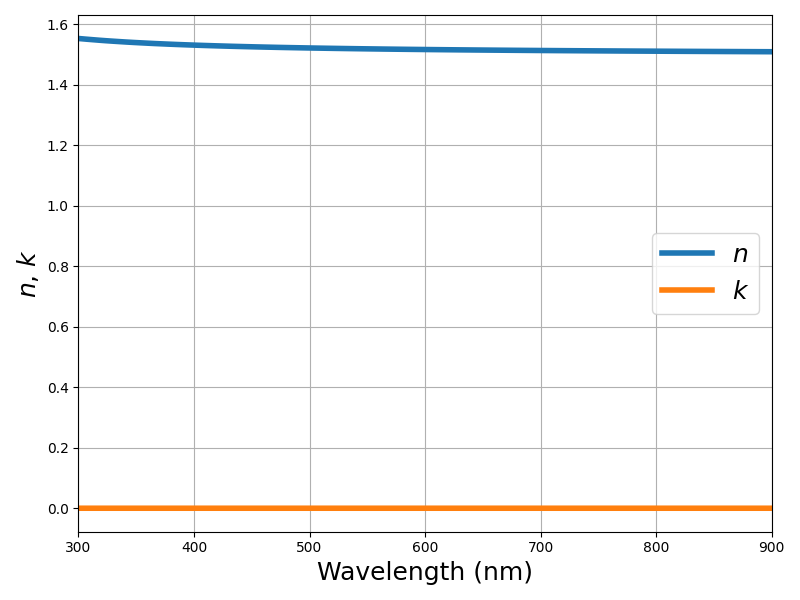

- Cr

- cSi

- Cu

- Fe

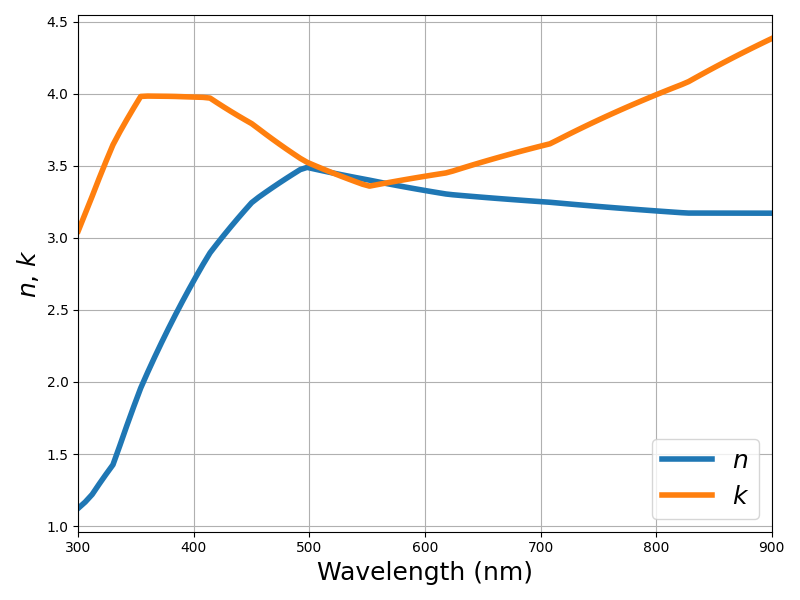

- FusedSilica

- GaAs

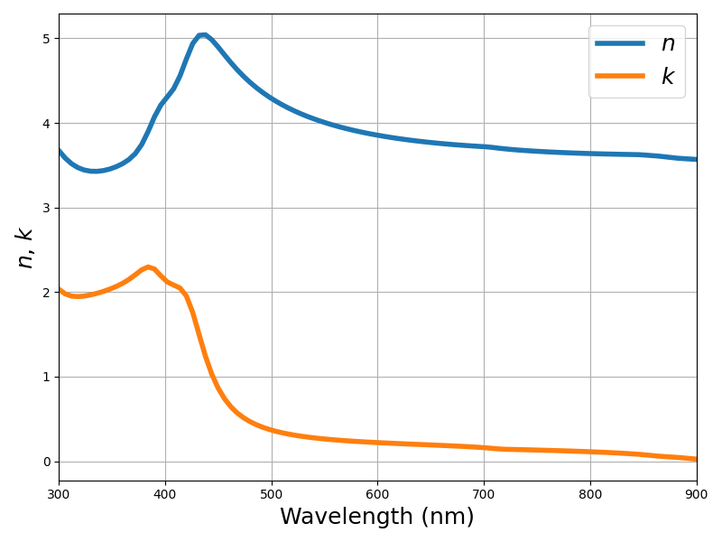

- GaInP

- GaP

- Ge

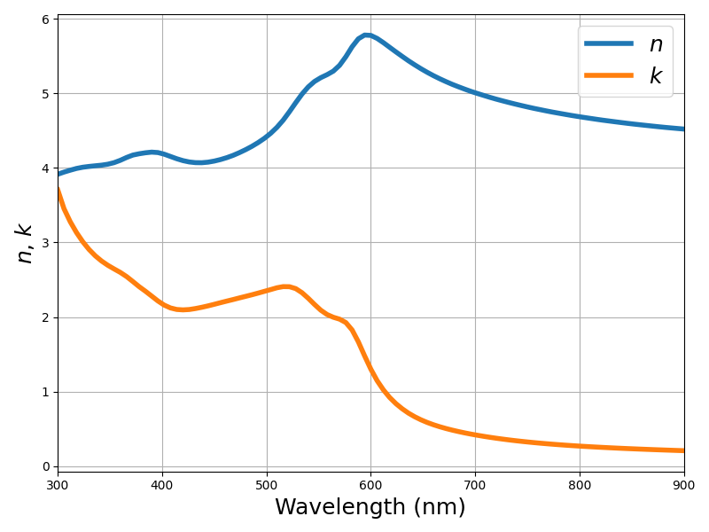

- InP

- ITO

- ITO-Zarei

- Mg

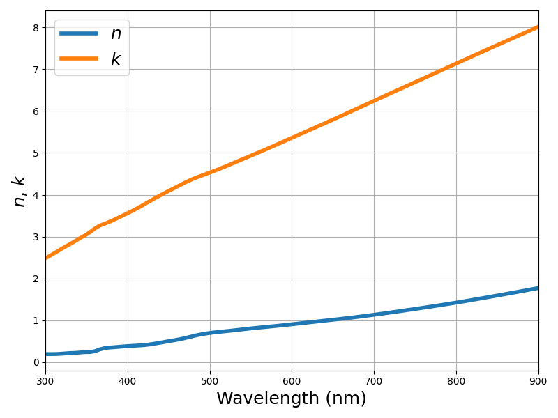

- Mn

- Ni

- Pb

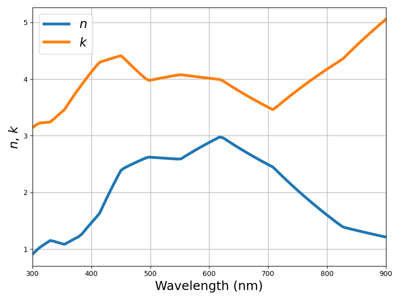

- Pd

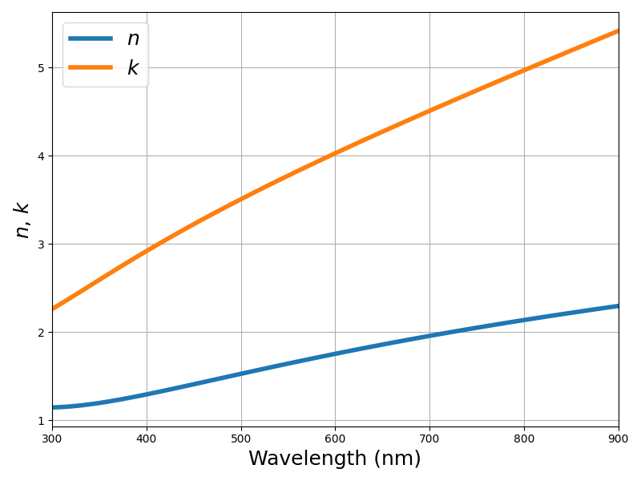

- Pt

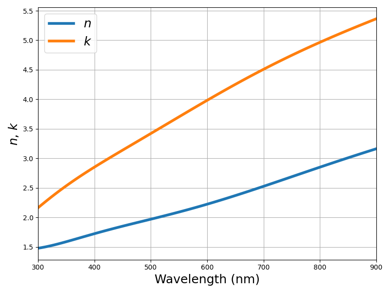

- Sapphire

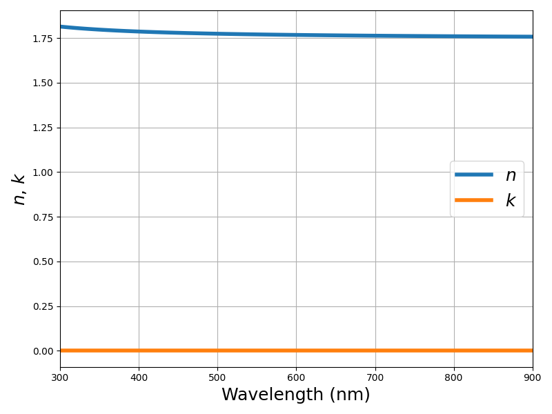

- Si3N4

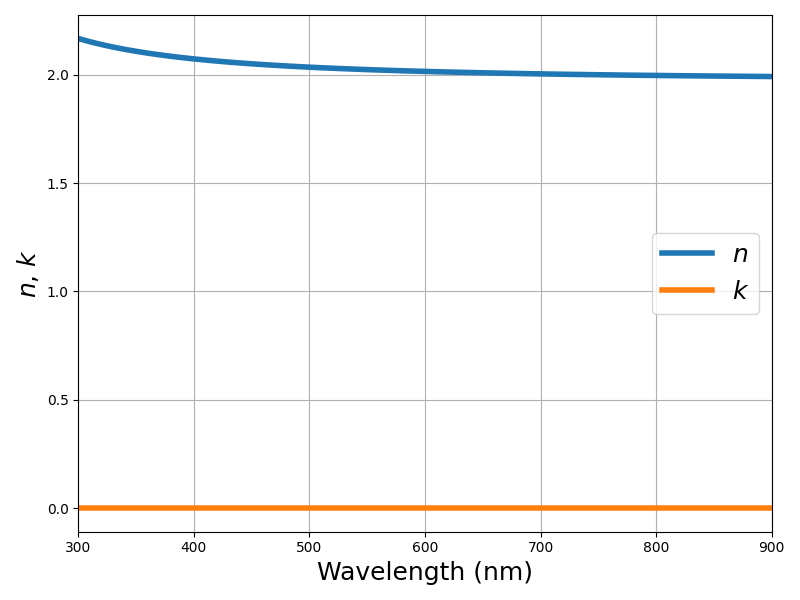

- Si3N4-Zarei

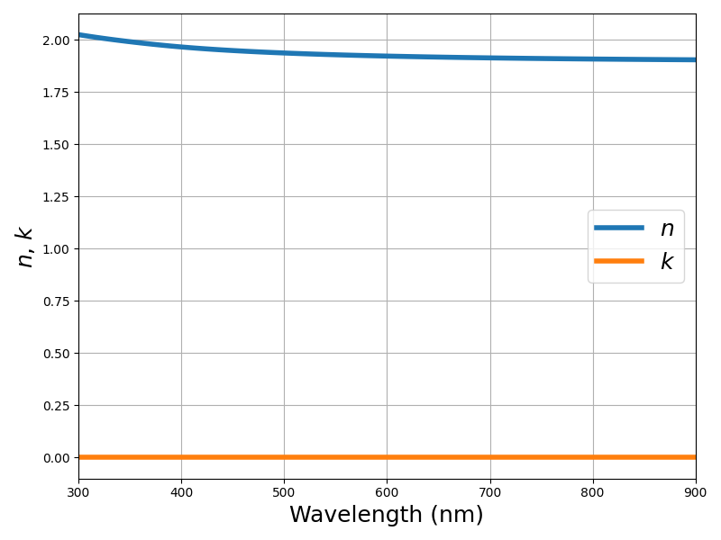

- SiO2

- SiO2-Zarei

- TiN

- TiO2

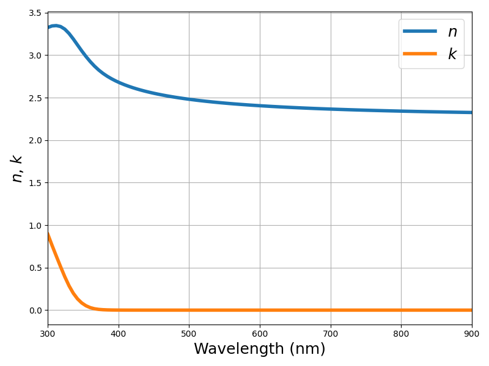

- TiO2-Zarei

- Ti

- W

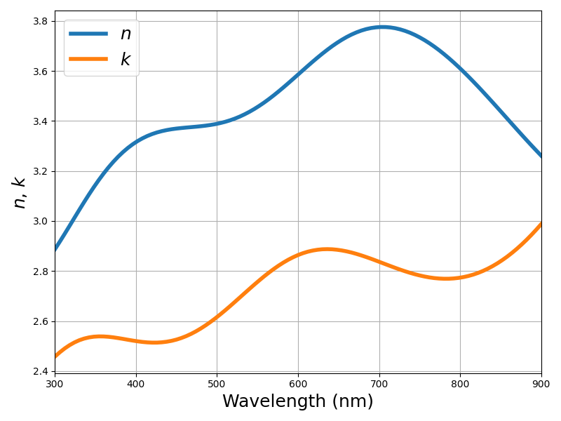

- ZnO

- Zn

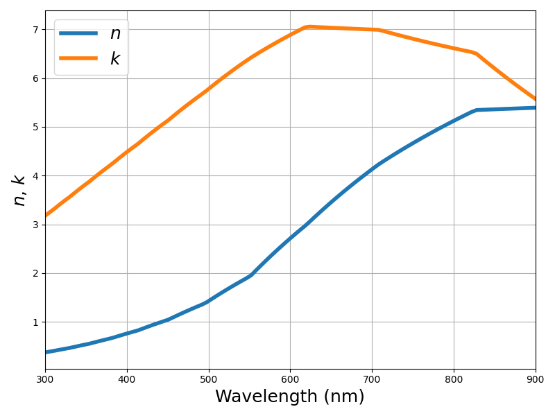

