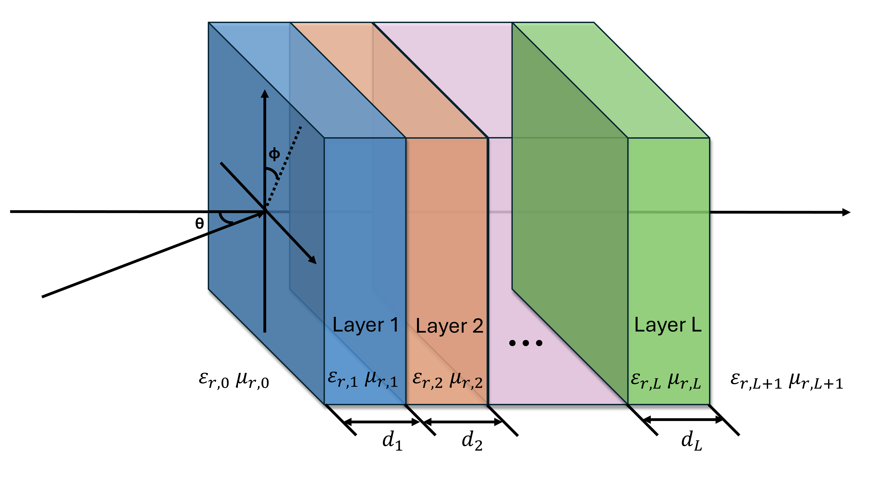

# Summary
JaxLayerLumos is an open-source Python software package for simulating electromagnetic wave interactions with multilayer structures using the transfer-matrix method (TMM). It is designed for researchers and engineers working with applications in optics, photonics, and radio frequencies.  The software efficiently computes  reflection, transmission, and absorption across a broad spectral range. A key feature of JaxLayerLumos is its implementation in JAX [@jax2018github], which enables automatic differentiation with respect to any input parameter (e.g., layer thickness, refractive index, permeability) and supports fast execution on GPUs and TPUs. This differentiability is especially valuable for gradient-based optimization and for integrating simulations into machine learning pipelines, accelerating the discovery and design of novel devices and materials.

# Statement of need

Multilayer structures are essential in a wide range of technologies, including optical filters, next-generation solar cells, structural color coatings, and radar-absorbing materials. The transfer-matrix method [@BornWolf1999] is a foundational analytical technique for modeling wave inetractions in these systems. We compare the capabilities of several TMM implementations,
[Ansys Optics](https://www.ansys.com/products/optics), [TMM-Fast](https://github.com/MLResearchAtOSRAM/tmm_fast), [tmm](https://github.com/sbyrnes321/tmm), and our open-source package, JaxLayerLumos, 
in the table below:

| Feature | Ansys Optics (stackrt) | TMM-Fast (PyTorch/NumPy) | tmm (sbyrnes) (Pure Python) | JaxLayerLumos (Jax) |
|-----|-----|-----|-----|-----|
| **Lightweight** | ❌ Commercial, bulky | ✅ Lightweight | ✅ Lightweight | ✅ Lightweight |
| **Speed** | ⚠️ Moderate | ✅ Fast  | ❌ Slow (CPU-bound) | ✅ Fast |
| **Gradient Support** | ❌ | ✅ Yes | ❌ | ✅ Yes |
| **GPU Support** | ❌ | ✅ Yes | ❌ | ✅ Yes |  
| **TPU Support** | ❌                               | ❌                        | ❌                  | ✅ Yes         |  
| **Position-Dependent Poynting** | ❌                  | ❌                        | ❌                  | ✅  Supported                        
| **Optical Simulation** | ✅ Full-spectrum                 | ✅ Optimized              | ✅ Basic            | ✅ User-defined          |  
| **Infrared Simulation** | ❌ Limited                       | ✅ Limited                | ❌                 | ✅ User-defined          |  
| **Radar (HF) Simulation** | ❌ Limited                       | ❌                        | ❌                 | ✅ Includes magnetic materials |  
| **Material Database** | ✅ Extensive (Commercial)        | ❌ User-defined           | ❌ User-defined     | ✅ Growing library       |  
| **Open Source** | ❌                               | ✅ MIT                    | ✅ BSD-3-Clause     | ✅ MIT                   |  

Most TMM implementations, such as [@tmmSbyrnes] and [@tmm_fast]), focus primarily on optical wavelengths (UV-Vis-IR) and lack support for magnetic materials or frequencies relevant to radio frequency (RF) and microwae applications.  There is a growing need for simulation tols that 
* Operate efficiently across a broader spectral range--including optical, RF, and microwave frequencies,
* Handle magnetic and lossy materials with complex permittivities and permeability,
* Support modern workflows that integrate machine learning and large-scale optimization.  

JaxLayerLumos addresses this need by offering a JAX-based TMM framework. Its core advantages include:

* **Differentiability**: Automatically computes gradients with respect to any simulation parameter (e.g., layer thickness, refractive index), enabling inverse design, sensitivity analysis, and seamless integration with gradient-based optimization and machine learning pipelines.

* **High Performance**: Utilizes JAX’s just-in-time (JIT) compilation and hardware acceleration (CPU, GPU, TPU) for fast computation—ideal for large parameter sweeps or model training.

* **Broad Spectral and Material Supporty**: Accommodates complex refractive indices and permeabilities (necessary for magnetic and RF materials), customizable layer structures, oblique incidence, and both TE and TM polarizations—enabling simulations across optical, RF, and microwave regimes.

* **Ecosystem Integration**: Easily integrates with Python’s scientific computing stack, including optimization libraries and ML frameworks like JAX and TensorFlow.

These capabilities make JaxLayerLumos particularly valuable for researchers working at the intersection of computational electromagnetics and machine learning. It is well-suited for tasks such as training neural networks for inverse design (predicting layer structures from target spectra) and performing large-scale device optimization across broad frequency ranges. As an open-source, lightweight alternative to commercial tools, it offers speed, flexibility, and ease of use for advanced research.

# Mathematics

<!-- Add Figure showing schematic -->

The core of JaxLayerLumos implements the TMM method, which calculates the propagation of electromagnetic waves through a stack of $L$ planar layers.  It calculates key optical properties, such as reflection $R(f)$, transmission $T(f)$, and absorption $A(f)$, as functions of frequency $f$ or wavelength $\lambda$.  The software also supports position-resolved absorption and per-layer absorption calculations. Each layer $j$ is defined by 
* thickness $d_j$,
* complex relative permittivity $\varepsilon_{r,j}$, and
* complex relative permeability $\mu_{r,j}$.
  
For a given frequency $f$ and incidence angle $\theta_0$, the propagation of light is described by interface matrices $\mathbf{D}_j$ 
that capture Fresnel coefficients at the boundary between adjacent layers and propagation matrices $\mathbf{P}_j$ representing full wave propation within each layer and captures both phase shift and attenuation due to absorption in lossy media.  The total transfer matrix $\mathbf{M}$ for the entire stack is the product of these individual matrices:
$\mathbf{M}=(\mathbf{P}_0\mathbf{D}_0)(\mathbf{P}_1\mathbf{D}_1)\cdots(\mathbf{P}_L\mathbf{D}_L)\mathbf{P}_{L+1}$
<!--$\mathbf{M}=(\mathbf{P}_0\mathbf{D}_0)(\mathbf{P}_1\mathbf{D}_1)\cdots(\mathbf{P}_{L}\mathbf{D}_{L})\mathbf{P}_{L+1}$-->

<!-- From the elements of $\mathbf{M}$, the complex reflection $r$ and transmission $t$ amplitudes are calculated, from which $R = |r|^2$ and $T = |t|^2 \times \text{factor}$ (where factor accounts for impedance and angles of incident/exit media) are derived. -->
<!-- JaxLayerLumos uses `lax.associative_scan` in JAX for efficient parallel computation of the matrix product. Is this that important?-->

# Mention of use
<!-- Add Figuer showing applications -->
The use case can be found under example folder 

JaxLayerLumos is built for a wide range of applications in optical and RF science and engineering. Example use cases provided with the software demonstrate its versatility:

* **Radar-absorbing materials and frequency-selective surfaces**: Simulate spectral responses in the microwave and RF ranges, with full support for magnetic materials.
* **Thin-film structural optimization**: Use Bayesian optimization or gradient-based methods to tailor spectral responses across both optical and RF domains.
* **Solar cell design**: Model and analyze single- and multi-junction solar cell architectures.
* **Structural color**: Explore engineered structural coloration for novel material design.
* **Inverse design with machine learning**: Train Transformer-based models using datasets generated by JaxLayerLumos to design optical coatings and RF devices.

Due to its differentiability and high-performance execution, JaxLayerLumos is well-suited for both advanced research in complex electromagnetic systems and educational use in computational photonics and applied electromagnetics.

# Acknowledgements

We acknowledge the developers of JAX [@jax2018github] and other open-source libraries that JaxLayerLumos builds upon. This work was supported by the Center for Materials Data Science for Reliability and Degradation (MDS-Rely), an Industry-University Cooperative Research Center (IUCRC) of the National Science Foundation (NSF). The University of Pittsburgh, Case Western Reserve University, and Carnegie Mellon University are participating institutions in MDS-Rely. We also thank the open-source community for contributions and feedback.

# References
